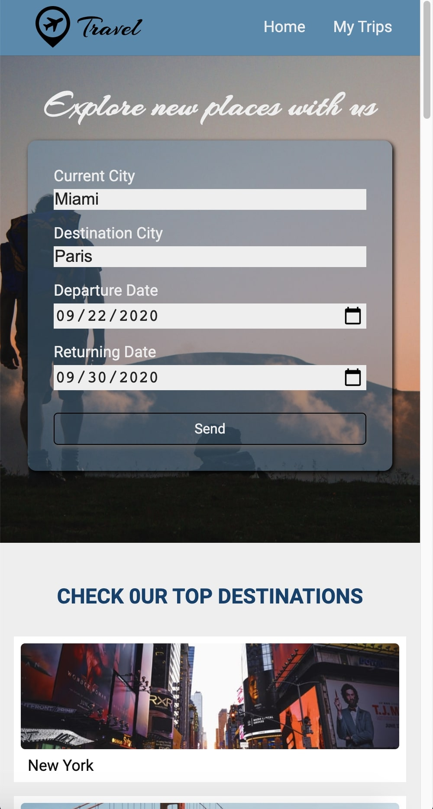
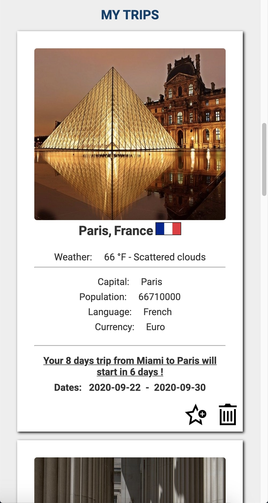

# Travel App

This web application helps to plan trips. Simply enter the desired destination and dates of the trip.

Home            |  My Trips
:-------------------------:|:-------------------------:
  |  

## API Used

* [Geonames API](http://www.geonames.org)
* [Weatherbit API](https://www.weatherbit.io)
* [Pixabay API](https://pixabay.com)
* [Restcountries API](https://restcountries.eu/)

## Built With

- HTML5 - Markup
- SASS - Styling
- JS - Client side language
- Webpack - Asset management
- Node JS - Server side language
- Express - Server side framework
- Babel - JS compiler
- Service Workers - Offline capability
- Jest - Testing suit

## Getting started

`cd` into your new folder and run:
- `npm install`